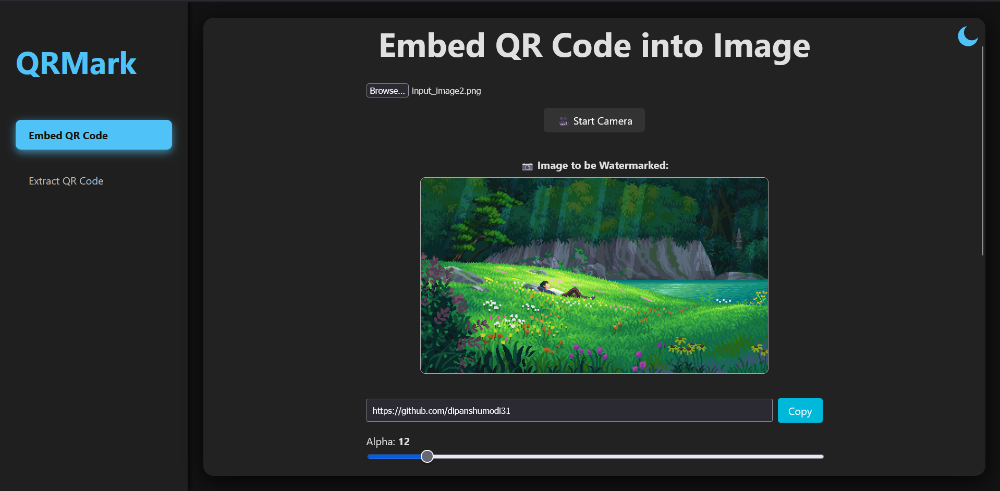
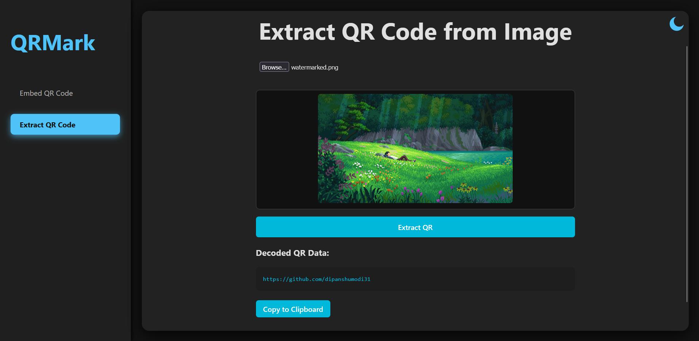

# 📷 QRMark — Real-Time Image QR Watermarking Platform

> Embed and extract invisible QR codes in images using advanced image processing — all in your browser.

---

## 🧠 Overview

**QRMark** is a real-time, browser-based platform for **semi-invisible QR code embedding and extraction**. It uses **Discrete Wavelet Transform (DWT)** on the **Cr channel of the YCbCr color space** to hide QR codes inside images without compromising visual aesthetics. Whether you're uploading a digital image or scanning a photo from a camera, QRMark ensures reliable data retrieval — even after print-scan cycles or image compression.

Built with:
- ⚛️ **React** frontend for intuitive interaction
- 🚀 **FastAPI** backend for high-performance processing
- 🔬 **OpenCV + PyWavelets** for robust QR watermarking

---

## 🔥 Features

✅ Embed QR codes invisibly into uploaded or captured images  
✅ Real-time webcam integration via browser  
✅ Robust DWT-based image watermarking  
✅ Reliable extraction — even from printed or scanned images  
✅ Clean UI with dark/light mode and modal previews  
✅ One-click local startup script for easy testing

---

## 📂 Project Structure

```
qrmark/
├── frontend/         # React frontend with camera support and upload preview
├── backend/          # FastAPI backend for QR embedding/extraction
└── start.bat         # One-click startup script (Windows)
```

---

## 🚀 Getting Started

### Prerequisites

- Python 3.10+
- Node.js 16+
- Git

### Clone the repo

```bash
git clone https://github.com/yourusername/qrmark.git
cd qrmark
```

### 🖱️ One-click Start (Windows only)

Just double-click:

```
start.bat
```

This will:
- Launch the FastAPI backend (`http://localhost:8000`)
- Launch the React frontend (`http://localhost:5173`)
- Open your default browser

### 🔧 Manual Start (optional)

#### Backend (FastAPI)

```bash
cd backend
pip install -r requirements.txt
uvicorn main:app --reload
```

#### Frontend (React)

```bash
cd frontend
npm install
npm run dev
```

---

## 🧪 Usage

### ➕ Embed QR into Image

1. Open the frontend in browser
2. Upload an image or capture one with your webcam
3. Enter a URL or text to encode
4. Click **Embed**
5. Download or preview the watermarked image

### 🔍 Extract QR from Image

1. Upload a watermarked image or scan a printed copy
2. Click **Extract**
3. Get the decoded QR content instantly (with copy/share options)

---

## 🖼️ Output Previews

### Embedded Image Sample


### Extracted QR Code View


---

## 🧑‍💻 Technologies Used

| Layer       | Tech Stack                      |
|-------------|----------------------------------|
| Frontend    | React, Tailwind CSS, Vite       |
| Backend     | FastAPI, OpenCV, PyWavelets     |
| QR Handling | qrcode, pyzbar                  |
| Imaging     | NumPy, PIL                      |

---

## 📊 Project Goals

- 🧠 Real-time, robust QR watermarking via DWT
- 🤝 Intuitive interface for both technical and non-technical users
- 📷 Support for file and camera inputs
- 🖼️ Near-invisible watermarking with minimal distortion

---

## 📌 Success Metrics

- ✅ QR decoding success from webcam/photo: **≥ 95%**
- ⏱️ Average embed/extract time: **≤ 3 seconds**
- 🧭 UI error rate: **< 5%**
- 👍 Positive feedback on usability & clarity

---

## 📬 Contact & Contributions

Have feedback or want to contribute? Open an issue or reach out on [LinkedIn](https://www.linkedin.com/in/dipanshu-modi-75bb57278/).

Let’s build smarter watermarking tools together! 🚀
